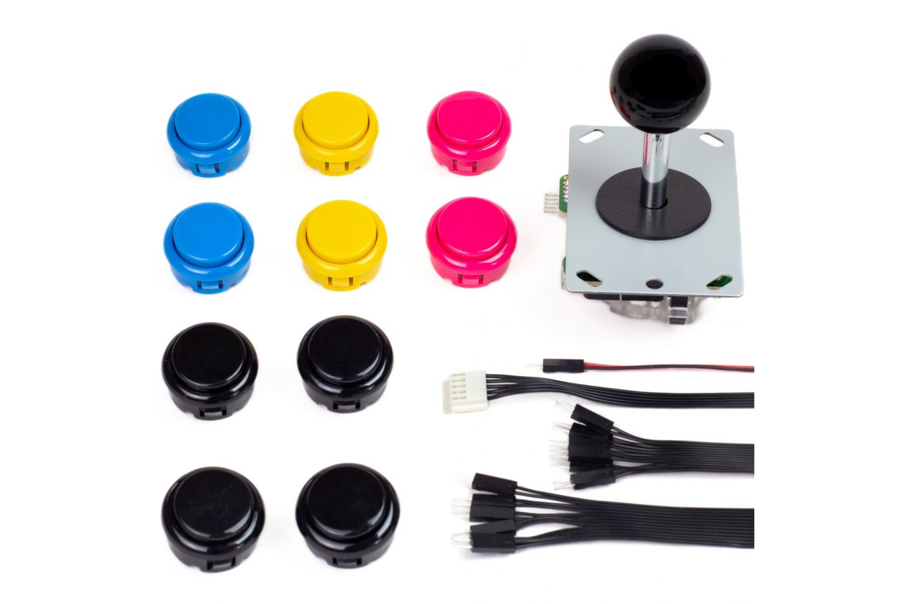
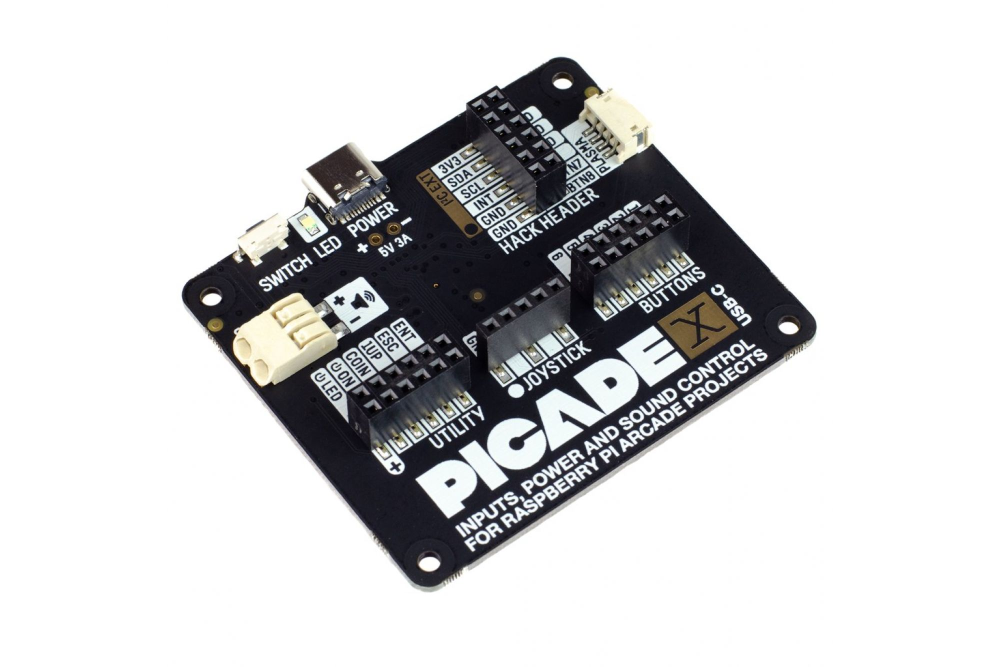
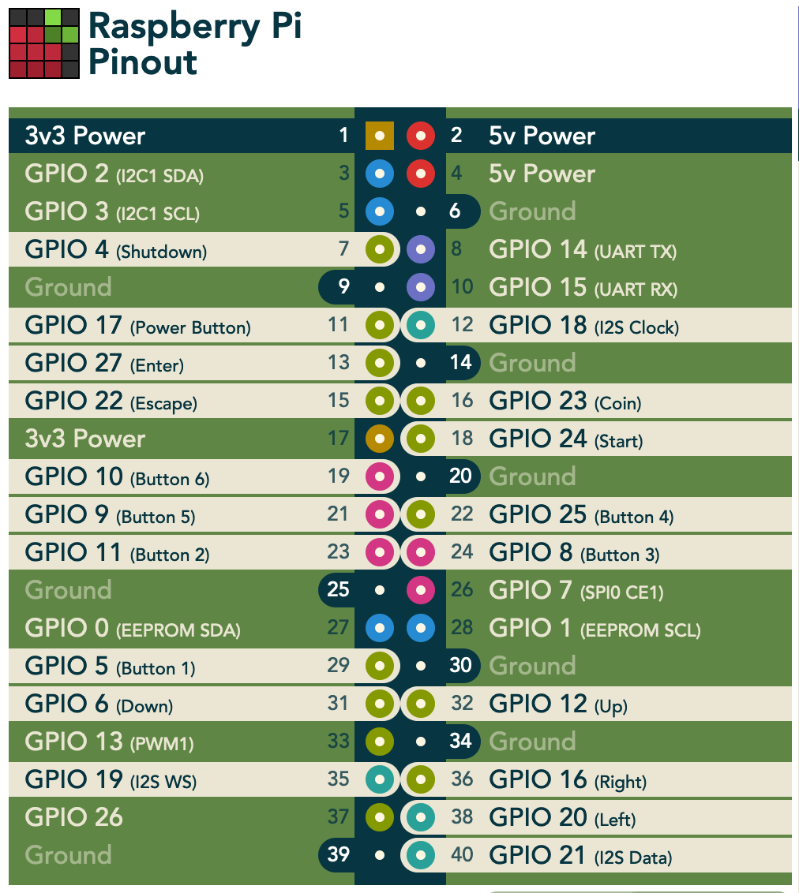

Pi4J V2 :: Java I/O Library for Raspberry Pi :: Example game application with FXGL
===================================================================================

[](https://github.com/Pi4J/pi4j-example-fxgl/actions/workflows/maven.yml)

This project contains an example application which uses the Pi4J (V2) library and uses an Arcade button and joystick kit
to control a JavaFX FXGL game. Full description is available on
[the Pi4J website](https://pi4j.com/getting-started/fxgl/)

## PROJECT OVERVIEW

The goal of the example project is to show how to set up a Pi4J Maven for the Raspberry Pi with JavaFX and some physical
buttons.

The full description is available on
[Game development with FXGL](https://pi4j.com/getting-started/fxgl/).

## COMPONENTS




Connections as documented on [pinout.xyz](https://pinout.xyz/pinout/picade_hat):



## RUNTIME DEPENDENCIES

This project uses Pi4J V.2 which has the following runtime dependency requirements:

- [**SLF4J (API)**](https://www.slf4j.org/)
- [**SLF4J-SIMPLE**](https://www.slf4j.org/)

As this application has a JavaFX user interface, the project requires the OpenJFX runtime. When the package is build, then the runtime is downloaded and added to the distribution directory.

## BUILD DEPENDENCIES & INSTRUCTIONS

This project can be built with [Apache Maven](https://maven.apache.org/) 3.6
(or later) and Java 11 OpenJDK (or later). These prerequisites must be installed prior to building this project. The
following command can be used to download all project dependencies and compile the Java module. You can build this
project directly on a Raspberry Pi with Java 11+.

```
mvn clean package
```

### Compiled application to run on the Raspberry Pi

Once the build is complete and was successful, you can find the compiled artifacts in the `target` folder. Specifically 
all dependency modules (JARs) and a simple `run.sh` bash script will be located in the `target/distribution` folder.

These are all the required files needed to distribute (copy) to your Raspberry Pi to run this project. If you are using
the native bindings running locally on the Raspberry Pi, then you may have to run the program using `sudo`
to gain the necessary access permissions to the hardware I/O.

This is the list of files created by the build process of this example application:

* pi4j-core
* pi4j-example-fxgl
* pi4j-library-gpiod
* pi4j-plugin-gpiod
* pi4j-plugin-raspberrypi
* slf4j-api
* slf4j-simple
* run.sh --> this is the actual start file which will run pi4j-example-fxgl

Start the application with the provided run script, you may need to adapt its content to match with the JavaFX runtime you installed:

```
./run.sh
```

## LICENSE

Pi4J Version 2.0 and later is licensed under the Apache License, Version 2.0 (the "License"); you may not use this file
except in compliance with the License. You may obtain a copy of the License at:
http://www.apache.org/licenses/LICENSE-2.0

Unless required by applicable law or agreed to in writing, software distributed under the License is distributed on an "
AS IS" BASIS, WITHOUT WARRANTIES OR CONDITIONS OF ANY KIND, either express or implied. See the License for the specific
language governing permissions and limitations under the License.

